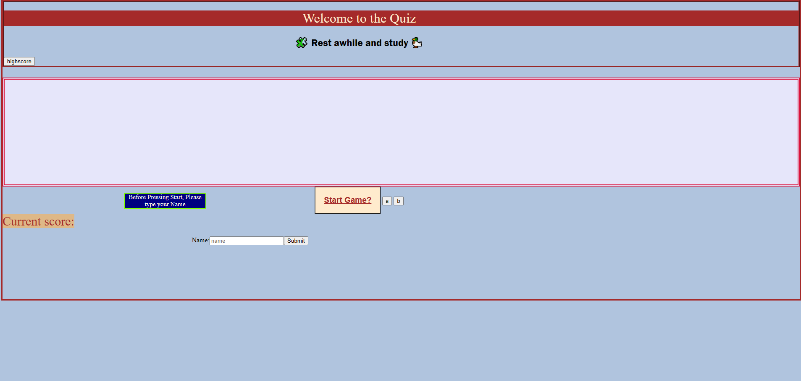

# MultipleChoiceQuiz

[my live site](https://teelsam.github.io/MultipleChoiceQuiz/)

## Description

Here is my Quiz on Javscript concepts!
Entering your name to log you score, then pressing start will load questions. Each quesiton has two possible answers, a and b, which work with corresponding buttons. Once youve made the correct choice the next question loads. A or B either add to score or decrease the timer. Once timer reaches zero or you answer all the questions, your score will be compared to other locally stored scores and place them on the highscore list.

## Table of Contents

An index.html file with the structure of the site.
An assets file containing a css file, site screenshot and a javascript file.
and this README file.

## ScreenShot

.
